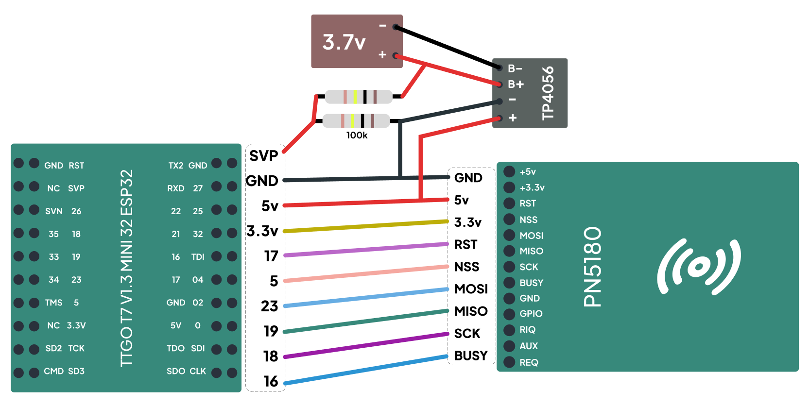
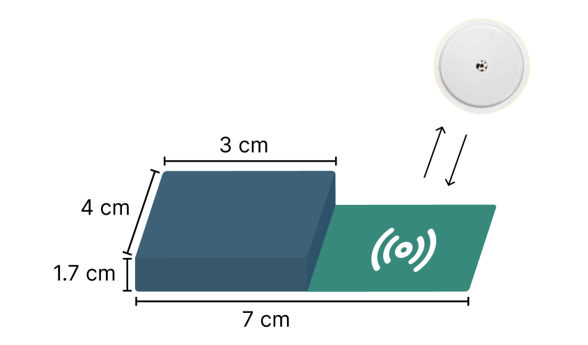

# Dispositivo Vestível para Monitoramento Glicêmico

O objetivo deste projeto é desenvolver um dispositivo wearable capaz de realizar o
monitoramento contínuo de glicemia em pessoas que necessitam de controle e tratamento de glicose no sangue. O dispositivo será responsável por capturar os dados do sensor FreeStyle Libre e transmiti-los para um back-end, onde poderão ser consultados e analisados.

## Componetes utilizados

### TTGO T7 V1.3 MINI 32 ESP32
[Ver item](https://amzn.to/4ithNLv)

Uma versão compacta desenvolvida pela LiLyGO. Essa placa mantém
todas as características do ESP32, com a vantagem de ser menor em tamanho.

### PN5180 - Módulo NFC
[Ver item](https://amzn.to/3F8Admp)

A compatibilidade entre o módulo NFC e o sensor FreeStyle Libre com as tecnologias que
ambos utilizam ISO/IEC 15693, possibilitou a comunicação entre eles e a captura de
dados contidos na memória do sensor FreeStyle Libre.

### Bateria de Lítio 250 mAh
[[Ver item]](https://amzn.to/4hcitUB)

Para integrar esses componentes e alimentá-los adequadamente, foi utilizado o
microcontrolador ESP32, alimentado por uma bateria de lítio recarregável de 250mAh e
3,7volts.

### TP4056 - Módulo de carregamento
[[Ver item]](https://amzn.to/3DxxylN)

Controla o fluxo de energia durante o processo de recarga, permitindo o fornecimento de energia do sistema.

### 2 Resistor 100k
[[Ver item]](https://amzn.to/4hhf9rc)

Para evitar sobrecarga na bateria.

### Firebase
[[Google Firebase]](https://firebase.google.com/)

Back-end, fornecendo o armazenar os dados coletados do sensor FreeStyle Libre.

## Montagem esquema elétrico

 
 

## Variáveis de Ambiente

Para rodar esse projeto, você vai precisar adicionar as seguintes variáveis de ambiente no seu firebase_manager e wifi_manager

`const char* ssid = "ssid_wifi";`

`const char* password = "password_wifi";`

`const char* apiKey = "api_firebase";`

`const char* databaseUrl = "https://[seu-projeto]-default-rtdb.firebaseio.com"; `

`const char* userEmail = "email_user_auth";`

`const char* userPassword = "password_user_auth";`

